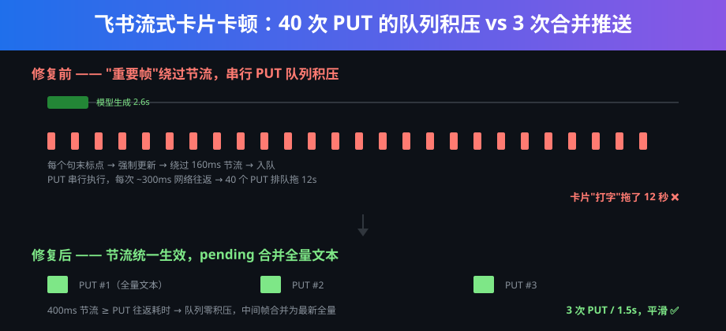

<div align="center">

# ⚡ 飞书流式回复"一字一顿"卡顿 — 根因分析与修复

**OpenClaw 飞书插件流式卡片补丁 · 12 秒拖拽感 → 1.5 秒丝滑输出**


[](#tldr)
[](#%E4%BF%AE%E5%A4%8D)
[](#%E6%8E%92%E6%9F%A5%E8%BF%87%E7%A8%8B)

**症状一句话**：模型 2.6 秒就生成完了，飞书卡片却"打字"打了 12 秒——每个句末标点都绕过节流触发一次 ~300ms 的串行 PUT，40 个请求排成长队。

</div>

---



---

针对 OpenClaw（v2026.8.1）官方飞书插件 `@openclaw/feishu` 的流式回复卡顿问题的根因分析与补丁。

## TL;DR

插件的一个"善意"优化——句末标点等"重要更新"可以**绕过节流**直接推送——在真实网络条件下变成了性能杀手：

> 每次卡片内容 PUT 是一次 ~300ms 的网络往返，且所有更新走**串行队列**。一次 2.6 秒生成的回复，排队了 **40 个 PUT**，硬生生拖成 **12 秒**的"打字机"。

修复只改 3 个常量/条件，让节流对**所有**更新统一生效（中间帧合并为最新全量文本，不丢内容）。修复后同样的回复只需 **3 次 PUT / 1.5 秒**。

## 排查过程

### 第一步：先怀疑模型/核心层

最初以为是模型慢或者 OpenClaw 核心的 block streaming 攒批（`DEFAULT_BLOCK_STREAM_MIN=800`，不足 800 字会攒到 idle 1s 才发）。把 `channels.feishu.streaming` 里的 block 合并段删掉、只留 `{"mode":"partial"}`，有改善但没治本。

另外还有一个前置坑（与本仓库无直接关系，但同一场景下会叠加"半天憋一段"的体验）：OpenClaw 对 `anthropic-messages` API 的 deepseek-v4 不会自动关思考模式，配 `lan` provider 时要用 `"api":"openai-completions"`（baseUrl 以 `/v1` 结尾），核心才会自动附带 `thinking:{"type":"disabled"}`。思考段的流式帧在飞书卡片里不显示，表现为长时间空白。

### 第二步：给插件插桩，拿真实数据

在插件的 `updateCardContent`（实际执行卡片 PUT 的函数）里插入文件日志，记录每次 PUT 的时间戳和字数，然后在飞书发消息触发一次流式回复：

```
14:32:05.1  PUT len=14   ← 生成进行中
14:32:05.4  PUT len=19
14:32:05.7  PUT len=24
...（每 ~300ms 一次，持续到 14:32:17）
```

对照 `audit_events`（`agent.run.started` / `agent.run.finished`）：模型流式生成 **2.6s** 就结束了，但 PUT 队列拖了 **12s**。约 40 次 PUT × ~300ms/次，完全吻合——卡顿不在生成侧，在推送侧。

### 第三步：定位"为什么会有 40 个 PUT"

插件源码（dist 反压缩后）里的流式更新逻辑：

```js
function shouldPushStreamingUpdate(previousText, nextText) {
  return !previousText
      || /[\n。！？!?；;：:]$/.test(nextText)      // ← 句末标点
      || nextText.length - previousText.length >= STREAMING_SIGNIFICANT_DELTA_CHARS; // ← 大增量
}
```

而 `update()` 的节流判断是：

```js
if (!shouldForceUpdate && now - this.lastUpdateTime < this.updateThrottleMs) {
  this.schedulePendingFlush();
  return;   // 节流：把文本留给 pending，延后合并推送
}
```

注意 `!shouldForceUpdate &&`——凡是判定为"重要"的帧（中文回复几乎**每个句子**都以 。！？结尾），**完全绕过节流**，立即入队。

而入队的 PUT 是串行执行的（`this.queue = this.queue.then(...)`），每个 PUT 要等上一个完成（一次完整 HTTP 往返，飞书 open API 实测 ~300ms）。模型以高频小 delta 流式输出，每个句末标点都触发一次"强制更新"，队列长度爆炸。

### 为什么卡片还有 50ms/字的打字机动画，看起来还是卡？

飞书 cardkit 流式卡片（schema 2.0，`streaming_mode:true`，`print_frequency_ms:50`）自带客户端打字机动画，本来是用来平滑显示的。但动画只在**收到新内容**时推进——300ms 才喂一帧，动画就变成 300ms 一停的机械步进，和 Telegram 那种真正平滑的编辑消息完全不是一回事。

## 修复

对 `dist/monitor.account-*.js` 打 3 处补丁（本仓库的 `scripts/apply-patch.mjs` 一键完成）：

| # | 位置 | 原值 | 新值 | 作用 |
|---|------|------|------|------|
| 1 | `update()` 节流条件 | `if (!shouldForceUpdate && now - ...)` | `if (now - ...)` | **核心修复**：节流对所有更新统一生效，中间帧合并进 `pendingText`（不丢内容，下帧为全量文本） |
| 2 | `STREAMING_UPDATE_THROTTLE_MS` | 160 | 400 | 推送节奏上限 ≈2.5 帧/秒，覆盖大多数 PUT 往返耗时，队列不再积压 |
| 3 | `STREAMING_SIGNIFICANT_DELTA_CHARS` | 18 | 8 | 保底逻辑：即便走了"重要更新"路径（补丁 1 后已不影响节流），阈值也更贴近真实输出节奏 |

修复后实测：同一类回复 **3 次 PUT / 1.5s**，卡片动画连续平滑，与 Telegram 体验一致。

### 关于补丁 1 的取舍

去掉强制更新路径后，"长句中间不推送"的最坏等待 = 节流间隔 400ms，远小于原来队列积压造成的秒级延迟。且 `pendingText` 始终保存最新全量文本，最终一致性无损失——飞书卡片本来就是全量覆盖式 PUT（`{content, sequence, uuid}`），不存在"丢帧"。

## 使用方法

> 前提：OpenClaw ≥ 2026.8.1，飞书插件 `@openclaw/feishu` v2026.8.1（其他版本常量/代码可能有偏移，脚本匹配失败会明确报错而不是改坏文件）。

```bash
node scripts/apply-patch.mjs            # 自动定位插件 dist 并打补丁（幂等，可重复运行）
node scripts/apply-patch.mjs --check    # 只检查当前补丁状态，不修改
```

脚本会扫描 `~/.openclaw/npm/projects/**/node_modules/@openclaw/feishu/dist/monitor.account-*.js`，逐条应用 3 处替换，任一条匹配不到即中止报错（0 或多处匹配都会拒绝），不会产生半截补丁。

**重要**：`openclaw plugins update feishu` 会用官方包覆盖 dist，补丁会被还原——更新插件后重跑一次脚本即可。建议给这条命令建个别名。

## 已知限制

- 直接改的是插件 dist（压缩但带缩进），不是源码 patch-file PR——上游若改了这几行的写法，脚本会匹配失败并提示，需要更新匹配串。
- 本仓库只分发补丁脚本与分析，**不分发插件本体**（`@openclaw/feishu` 版权归 OpenClaw 官方所有）。
- 参数 400ms/8 字是经验值，针对国内直连飞书 open API ~300ms 往返调的；如果你的网络往返显著不同，可自行微调 `STREAMING_UPDATE_THROTTLE_MS`。

## 给上游的建议

真正治本应该在插件源码里做，希望能合入类似改动：

1. 流式 PUT 的节流不应被"重要帧"绕过（或者至少强制帧也走同一个队列预算）；
2. PUT 往返耗时 > 节流间隔时，应自适应拉大间隔（背压），而不是无限积压队列；
3. 队列积压时可合并 pending（插件已有 `mergeStreamingText`，但强制路径没用上它）。

## 环境

- OpenClaw 2026.8.1（gateway 模式，Windows）
- 模型：deepseek-v4-flash（lan provider，`openai-completions` API）
- 飞书渠道：cardkit schema 2.0 流式卡片，`streaming: {"mode":"partial"}`

## License

本仓库内容（分析文档与补丁脚本）以 [MIT](LICENSE) 发布；不包含、不分发 OpenClaw 或飞书插件的任何代码。
